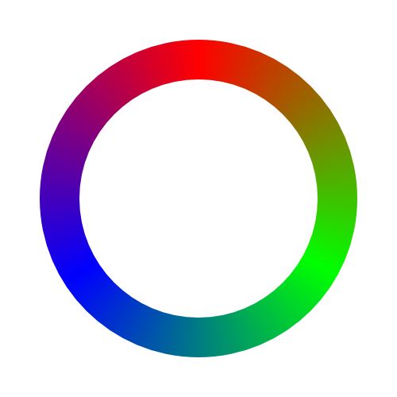

<h1>Synesthesia</h1>

Discordで色を見ることが出来るBotです。

<h1>使い方</h1>

・ $color [#hex|hex|r,g,b|r, g, b]  
指定したカラーコードの色情報を表示します。  
例: $color #ffd1dc

・ $random (colorCategory)  
ランダムな色を生成します。  
_colorCategory_ を指定した場合その色に近い色から生成します。  
例: $random blue

